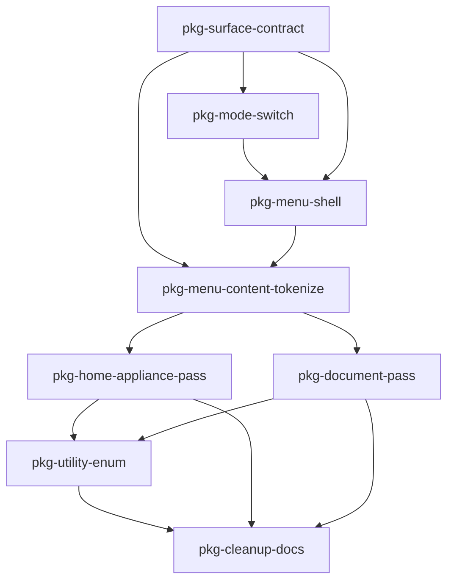

# Appliance vs Document surface plan

This plan defines a staged, low-risk rollout for making route styling systematic around two intentional UI modes:

- **Appliance mode** (home route): controls read as part of the tide instrument face.
- **Document mode** (all other routes): low-key light surfaces and conventional app-shell cues.

The home diagram color system is already tuned and is **out of scope for color changes** in this plan.

## Problem statement

Color and surface decisions are currently spread across `src/app.css`, `src/ui/components/PrimaryNavMenu.svelte`, `src/ui/components/PrimaryMenuContent.svelte`, and home-route component styles.

This produces two issues:

- Mode intent exists in product design, but not as an explicit styling contract.
- Shared menu content is forced to straddle two visual contexts without a systematic container/surface strategy.

## Goals

- Encode the two-mode model (`appliance`, `document`) as an explicit styling contract.
- Move color/surface values behind semantic CSS variables.
- Keep shared menu **content structure** unified while allowing mode-specific shell treatment.
- Keep rollout safe across multiple sessions with clear package boundaries and verification steps.

## Non-goals

- Redesigning the tide diagram artwork or its internal palette.
- Large component architecture refactors unrelated to surfaces/tokens.
- Introducing a broad utility class framework in one pass.

## Design policy (source of truth)

### 1) Mode ownership

- `appliance`: used where UI should feel integrated into instrument hardware (home route).
- `document`: used where UI should feel like a conventional app page (other routes).

### 2) Surface role naming

Use semantic role tokens, not literal colors, for surfaces/text/borders:

- `--surface-page`
- `--surface-panel`
- `--surface-overlay`
- `--text-primary`
- `--text-muted`
- `--border-subtle`
- `--focus-ring`

Each role resolves differently by mode.

### 3) Shared menu policy

- Shared menu **content** remains in `PrimaryMenuContent`.
- Shared menu **shell/skin** becomes mode-aware via variables and/or a small appearance prop.
- Home menu must retain appliance-integrated feel; non-home menu remains document-friendly.

### 4) Utility policy

- Allow a small, enumerated global utility set.
- Keep utilities token-backed and documented.
- Prefer limited layout utilities; avoid a large bespoke shorthand vocabulary in one pass.

---

## Multi-session strategy

Each package is intentionally reviewable in isolation and should be completed in separate sessions where practical.

**Session handoff:** after each session, record package status and verification notes in a companion progress file (recommended: `docs/planning/appliance-vs-document-surface-progress.md`).

Suggested grouping:

| Session focus | Packages | Why separate |
| ------------- | -------- | ------------ |
| A — Token foundation | `pkg-surface-contract`, `pkg-mode-switch` | Establishes the contract first so later work consumes stable names. |
| B — Shared menu harmonization | `pkg-menu-shell`, `pkg-menu-content-tokenize` | Highest leverage shared surface; isolates conundrum without touching all routes. |
| C — Route migration | `pkg-home-appliance-pass`, `pkg-document-pass` | Applies tokens per mode, with visual verification before broader cleanup. |
| D — Utility and hardening | `pkg-utility-enum`, `pkg-cleanup-docs` | Final tidy-up and guardrails once behavior is stable. |

---

## Package `pkg-surface-contract` — Global semantic token contract

**Goal:** Introduce a minimal semantic variable contract in global CSS (`src/app.css`) for surfaces, text, borders, and focus states.

**Concrete steps:**

1. Add root-level semantic tokens and mode-specific overrides (no mass replacement yet).
2. Preserve existing visual output as closely as possible while introducing aliases.
3. Document token intent inline with brief comments.

**Acceptance:**

- Semantic token set exists and is readable.
- Existing routes remain visually stable before migration.

**Tests/verification:**

- Manual smoke across home + one non-home route.
- No obvious regression in contrast for existing controls.

---

## Package `pkg-mode-switch` — Mode context at app/layout level

**Goal:** Provide a single mode signal that styles can consume (`appliance` vs `document`).

**Concrete steps:**

1. Introduce mode marker on top-level route/app container (class or data-attribute).
2. Map home route to `appliance`; all other routes to `document`.
3. Keep this marker independent from header visibility decisions.

**Acceptance:**

- Mode can be inspected from DOM and is deterministic per route.
- No behavior changes in routing/navigation.

**Tests/verification:**

- Minimal unit/integration check for route-to-mode mapping if practical.
- Manual hash-route navigation verifies mode flips correctly.

---

## Package `pkg-menu-shell` — Mode-aware menu container surfaces

**Goal:** Make menu shells mode-aware while preserving shared menu content behavior.

**Concrete steps:**

1. Tokenize menu shell surfaces in:
   - `src/ui/components/PrimaryNavMenu.svelte`
   - `src/ui/routes/home/HomeRouteTidePanels.svelte` (home menu panel shell)
2. Ensure appliance mode shell feels instrument-integrated.
3. Ensure document mode shell remains low-key and light.
4. Keep geometry/placement logic unchanged.

**Acceptance:**

- Same menu content appears in both contexts with mode-correct shell styling.
- Home menu no longer depends on ad-hoc literal colors.

**Tests/verification:**

- Manual open/close checks in home and at least two document routes.
- Verify hover/focus/active affordances remain clear in both modes.

---

## Package `pkg-menu-content-tokenize` — Shared menu content colors via tokens

**Goal:** Remove hard-coded shared menu content colors and wire them to semantic tokens.

**Concrete steps:**

1. Tokenize action/install-flow/link styling in `src/ui/components/PrimaryMenuContent.svelte`.
2. Ensure content-level styles consume mode-resolved tokens from parent context.
3. Preserve copy and behavior exactly.

**Acceptance:**

- `PrimaryMenuContent` styles are semantic-token based.
- Home/document differences are inherited from mode context, not duplicated literals.

**Tests/verification:**

- Existing install flow behavior unchanged (manual + existing tests remain green).
- Text and controls meet practical legibility in both modes.

---

## Package `pkg-home-appliance-pass` — Home route appliance cohesion

**Goal:** Align home-only supporting surfaces with appliance intent without changing diagram palette.

**Concrete steps:**

1. Replace literal colors in home support surfaces with appliance-mode tokens, including:
   - loading/error muted states
   - home empty-state card (if kept in appliance context)
   - menu-trigger hover affordance overlays
2. Keep diagram scene colors untouched.
3. Keep interactions and layout unchanged.

**Acceptance:**

- Home route reads as one coherent appliance surface system.
- Diagram appearance remains unchanged.

**Tests/verification:**

- Manual visual pass across loading/ready/error/empty states on home.
- Confirm no regressions in menu trigger hit testing and hover behavior.

---

## Package `pkg-document-pass` — Non-home route document consistency

**Goal:** Align non-home routes and header/menu surfaces to document-mode tokens.

**Concrete steps:**

1. Migrate remaining light-mode literals in `src/app.css` and route/component styles to document tokens.
2. Keep current low-key monochrome look (do not restyle tone direction).
3. Ensure document routes remain visually consistent with each other.

**Acceptance:**

- Non-home routes draw from one document-mode token system.
- Existing calm light aesthetic is preserved.

**Tests/verification:**

- Manual route sweep (`about`, `settings`, `support`, `cookies`, `acknowledgements`, `location`).
- Verify header/menu parity across those routes.

---

## Package `pkg-utility-enum` — Small global utility catalogue (optional but recommended)

**Goal:** Introduce and document a constrained global utility set for recurring spacing/layout patterns.

**Concrete steps:**

1. Add a small enumerated utility set in global CSS (token-backed).
2. Adopt agreed naming scheme (including `q...` namespace if retained).
3. Use only where repetition is high and semantics remain clear.

**Acceptance:**

- Utility set is short, documented, and intentionally bounded.
- No utility sprawl or one-off additions in this pass.

**Tests/verification:**

- Manual scan confirms utilities are reused and not proliferating.

---

## Package `pkg-cleanup-docs` — Remove drift and codify guardrails

**Goal:** Finish migration cleanly and reduce future style drift.

**Concrete steps:**

1. Remove superseded literal values where semantic tokens now exist.
2. Add concise doc guidance for:
   - when to use mode tokens
   - when to use utilities
   - where shared menu shell vs content styling belongs
3. Record final decisions and any intentional exceptions.

**Acceptance:**

- No major duplicated color definitions remain in touched areas.
- Future contributors can apply mode-aware styling without rediscovering policy.

---

## Guardrails for future changes

Use these rules as a compact maintenance checklist now that the migration is in place:

1. **Mode first:** route-level mode (`data-surface-mode`) decides token resolution; do not branch per-component colors when a mode token can express intent.
2. **Semantic role tokens for component styling:** when styling surfaces/text/borders/focus, prefer existing semantic roles before introducing new literals.
3. **Shared menu split remains strict:** `PrimaryMenuContent` owns shared content behavior and content-level visuals; container shells own placement/surface treatment.
4. **Utilities stay constrained:** use only the enumerated global utility set (`u-pad-surface-sm`, `u-stack-sm`, `u-nav-link-list`) unless a repeated pattern clearly justifies extension.
5. **Home diagram palette remains protected:** appliance-mode support surfaces may evolve, but diagram artwork/internal palette stays out of scope for this surface system.

### Intentional exceptions (recorded)

- Mode token definitions in `src/app.css` intentionally use concrete color literals as source-of-truth values.
- Home SVG micro-animations (time-now pulse / colon heartbeat) intentionally remain literal behavior styles rather than tokenized design roles.

---

## Dependency graph (Mermaid)

`pkg-home-appliance-pass` and `pkg-document-pass` can run in either order after menu tokenization is stable.

---

## Definition of done (surface system pass)

- [x] Mode contract exists and is route-driven (`appliance` vs `document`).
- [x] Core surface/text/border/focus tokens exist and are used instead of key literals in touched components.
- [x] Shared menu content remains single-source while shell appearance is mode-correct.
- [x] Home route reads as appliance-integrated without changing diagram palette.
- [x] Non-home routes remain coherent with existing low-key document style.
- [x] Utility set (if added) is small, enumerated, token-backed, and documented.
- [x] Planning/progress docs updated with package completion and verification notes.

When all boxes are checked, this styling initiative is complete and future sessions can shift from system migration to incremental polish only.
