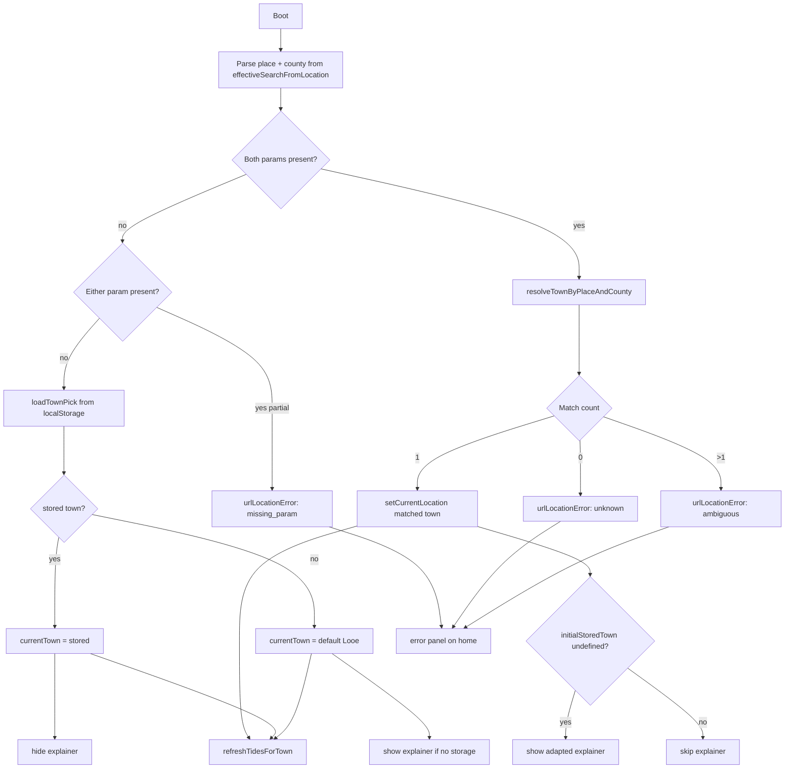

# Location from URL query parameter

Living plan for deep-linking a coastal place via `?…` on the home route.

**Status:** design decisions settled — ready for implementation  
**Last updated:** 2026-06-09

---

## Goal

Allow a shareable URL to open the live tide diagram for a specific place, fitting naturally with:

1. first-visit default (Looe, in-memory until dismissed),
2. `localStorage` persistence after explicit choice,
3. the corner explainer overlay and diagram-key onboarding.

---

## Decided policy (summary)

| Decision | Choice |
| --- | --- |
| **D1 Precedence** | URL always wins — `?place=…&county=…` applies on every visit, overwriting `current-location` |
| **D2 Explainer** | Adapted explainer — dynamic “Showing {place} tides” via `placeLine`; diagram key unchanged |
| **D3 Encoding** | Required pair: `place` + `county` (map to `Town.name` + `Town.county`; same normalization as picker) |
| **D4 Invalid param** | User-facing error on home — explain the link failed and how to proceed |
| **D5 URL retention** | Keep params in the address bar (consistent with D1: reload re-applies share intent) |

---

## Current location resolution (baseline)

Boot order in `App.svelte` today:

```
read localStorage `current-location`
  → if valid Town: use it, hide explainer
  → else: use defaultTideLocationTown (Looe), show explainer
onMount → refreshTidesForTown(currentTown)
```

| Concern | Mechanism |
| --- | --- |
| Persistence key | `current-location` — full `Town` JSON (`townPickSerde.ts`) |
| Default | `t2:cornwall:166` (Looe) via `defaultTideLocationTown` |
| User override | `setCurrentLocation(town)` from Location route — writes storage, hides explainer, refreshes tides |
| Default acceptance | `dismissDefaultLocationExplainer()` — persists Looe, hides explainer |
| Tide cache | `tide-extremes-at-location` — invalidated by lat/lon mismatch |
| URL today | dev-only: `diagramPreview`, `tideUxPreview`, `dom`/`outline`/`pf` — **no location params** |
| Query resolution | `effectiveSearchFromLocation(search, hash)` — `location.search` wins over `?` in hash |
| Route parsing | `router.js` strips query when resolving route id (`#/home?foo` → `home`) |
| Town lookup | `towns2ByTownId` (by opaque id); `queryTowns2ByCountyAndNamePrefix` (picker search) |

**Explainer gating** keys off `initialStoredTown === undefined` at boot, not “is current town the default?”. Copy is hardcoded to “Showing Looe tides” (`placeLine` prop exists but is unused in the overlay template).

---

## Fit assessment

### What aligns well

| Area | Why it fits |
| --- | --- |
| **Single orchestrator** | `setCurrentLocation` centralises storage, explainer dismissal, analytics, and tide refresh. URL resolution converges here once a `Town` is resolved. |
| **Query plumbing** | `homeUrlQuery.ts` + `effectiveSearchFromLocation` already abstract hash-vs-search precedence. |
| **Readable params** | `place` + `county` mirror stored `Town` fields and match how users think about coastal places. |
| **Normalization** | `normalizeTownSearchText` in `bakedTowns2.ts` (trim, lower-case, collapse spaces) can be reused for lookup. |
| **Hash routing** | Route id ignores query; `#/home?place=…&county=…` and `/?place=…&county=…` both land on home. |
| **Tide pipeline** | `refreshTidesForTown` + serial guard already handle rapid location changes. |
| **No server changes** | Static SPA; params are client-only. |

### Remaining friction (addressed in design)

| Issue | Resolution |
| --- | --- |
| **Precedence vs storage** | D1: URL always wins |
| **Explainer semantics** | D2: adapted copy; never show hardcoded Looe when diagram is elsewhere |
| **Param format** | D3: `place` + `county` (both required) |
| **Invalid / unknown param** | D4: user-facing error panel |
| **URL retention** | D5: keep params (reload = same share intent) |
| **Overlay copy** | Phase 3: wire `placeLine` into overlay title |
| **Analytics** | Phase 4: distinct event for URL-applied location |
| **Dev preview ordering** | Location param resolves before preview overrides tide *data*; preview still simulates load UX in DEV |

### Corpus note: `place` + `county` uniqueness

Shipped corpus should be unique on normalized `Town.name` + `Town.county`. Today **3 erroneous duplicate TSV rows** break that (6 towns); fix is planned separately — see [town-corpus-dedupe.md](./town-corpus-dedupe.md).

URL resolver still treats **>1 match as ambiguous** (D4) as defensive handling until dedupe ships.

---

## Design decisions (settled)

### D1 — URL vs `localStorage` precedence — **DECIDED: A**

**URL always wins.** Every visit with valid `?place=…&county=…` applies that town via `setCurrentLocation`, overwriting storage.

Rationale: share links and wall displays must land on the sender’s place even for returning users.

Implications:

- Opening a share link replaces the visitor’s saved place until they pick again or open another link.
- `setCurrentLocation` on boot is the right hook (storage write + tide refresh).
- No `replaceState` strip (see D5).

### D2 — Explainer when URL specifies a place — **DECIDED: adapted explainer**

Show the corner overlay with:

- Title: **“Showing {place} tides”** using `placeLine` (e.g. `Whitby, North Yorkshire`).
- Same 3-bullet diagram key and **Continue** button.

**When to show** (refined gate):

| Boot state | URL param | Explainer |
| --- | --- | --- |
| No storage at boot | valid URL place | Show adapted explainer |
| No storage at boot | no URL param (Looe default) | Show Looe-oriented explainer (current behaviour, but use `placeLine`) |
| Storage present | valid URL place overrides | **Skip** — returning user followed a link; they know the app |
| Any | invalid URL param | Error panel (D4), not explainer |

Dismissal persists the active town (URL-applied or default) like today.

### D3 — Parameter encoding — **DECIDED: `place` + `county`**

Both required. Example:

```
https://thetidedial.page/?place=Looe&county=Cornwall
https://thetidedial.page/#/home?place=Whitby&county=North%20Yorkshire
```

| Param | Maps to | Rules |
| --- | --- | --- |
| `place` | `Town.name` | Non-empty after trim; normalized via `normalizeTownSearchText` |
| `county` | `Town.county` | Non-empty after trim; same normalization |

Lookup: find all corpus rows where normalized name === normalized `place` **and** normalized county === normalized `county`.

| Match count | Outcome |
| --- | --- |
| 0 | User-facing error (unknown place) |
| 1 | Apply town |
| >1 | User-facing error (ambiguous — rare; see corpus note) |

**Not supported:** `loc=<townId>`, optional county, slugs, or single-param place-only links.

### D4 — Invalid param handling — **DECIDED: user-facing error**

When `place` or `county` is missing, malformed, unknown, or ambiguous:

- Do **not** silently fall through to storage or Looe.
- Show a dedicated home error state (new presentation kind or parallel to `loadFailed`):
  - Headline: link didn’t match a known place (plain language).
  - Body: both params are required; suggest checking spelling or using **Location** in the menu.
  - Optional: echo the received `place` / `county` values (helps “why didn’t this work?”).
- Do not load tides for a fallback town while the error is showing.
- Analytics: track `url_location_failed` with reason (`missing_param` | `unknown` | `ambiguous`).

Rationale: the visitor didn’t compose the link; they need an explanation, not a silent default.

### D5 — URL cleanup — **DECIDED: keep params**

Leave `?place=…&county=…` in the address bar so the URL remains copy-pasteable and reloads re-apply the same place (consistent with D1).

---

## Proposed resolution flow



---

## Likely touch points

| File | Change |
| --- | --- |
| `src/ui/homeUrlQuery.ts` | `placeAndCountyFromSearch(search)`; tests for precedence and partial params |
| `src/data/resolveTownFromPlaceAndCounty.ts` (new) | Exact normalized lookup; 0 / 1 / many results |
| `src/ui/App.svelte` | Boot resolver; URL-always-wins; error state; explainer gate |
| `src/ui/routes/home/routeProps.ts` | Optional `urlLocationError` prop or extend `TidePresentation` |
| `src/ui/routes/home/HomeRouteTidePanels.svelte` | Error panel UI |
| `src/ui/routes/home/HomeDefaultLocationExplainerOverlay.svelte` | Dynamic title from `placeLine` |

**Avoid:** duplicating persistence logic outside `setCurrentLocation` / `dismissDefaultLocationExplainer`.

---

## Phases (implementation)

### 1. Pure URL → Town resolver + tests

- `placeAndCountyFromSearch` in `homeUrlQuery.ts`
- `resolveTownByPlaceAndCounty(place, county, bakedTowns2)` → `{ kind: 'found', town } | { kind: 'unknown' } | { kind: 'ambiguous', count }`
- Cases: missing either param, partial param, unknown pair, ambiguous pair, search-vs-hash precedence, normalization edge cases

### 2. Boot integration (D1, D4)

- Resolver in `App.svelte` (or `resolveBootTown`) — URL branch before storage
- Wire `setCurrentLocation` on success; block tide load on error
- User-facing error panel on home

### 3. Explainer + overlay copy (D2)

- Dynamic title from `placeLine`
- Explainer gate: show only when `initialStoredTown === undefined` and URL valid (or Looe default with no URL)

### 4. Analytics

- `url_location_applied` on successful URL boot
- `url_location_failed` with reason

### 5. Documentation + share examples

- README / About: `?place=…&county=…` contract
- Example: `https://thetidedial.page/?place=Looe&county=Cornwall`

---

## Out of scope (for now)

- Corpus dedupe for the 3 duplicate `place`+`county` pairs — [town-corpus-dedupe.md](./town-corpus-dedupe.md)
- `loc=<townId>` or slug URLs
- Server-side redirects or pretty paths (`/looe`)
- Location param on non-home routes
- Auto-generating share URLs when user picks from Location menu
- Stripping query params after apply

---

## Conversation log

| Date | Notes |
| --- | --- |
| 2026-06-09 | Initial analysis. URL params fit orchestration layer. |
| 2026-06-09 | **D1:** URL always wins. **D2:** adapted explainer. **D3:** required `place` + `county` (not opaque id). **D4:** user-facing error, no silent fallback. **D5:** keep params in URL. |
| 2026-06-09 | Corpus dedupe split to [town-corpus-dedupe.md](./town-corpus-dedupe.md); out of scope for URL-location implementation. |
