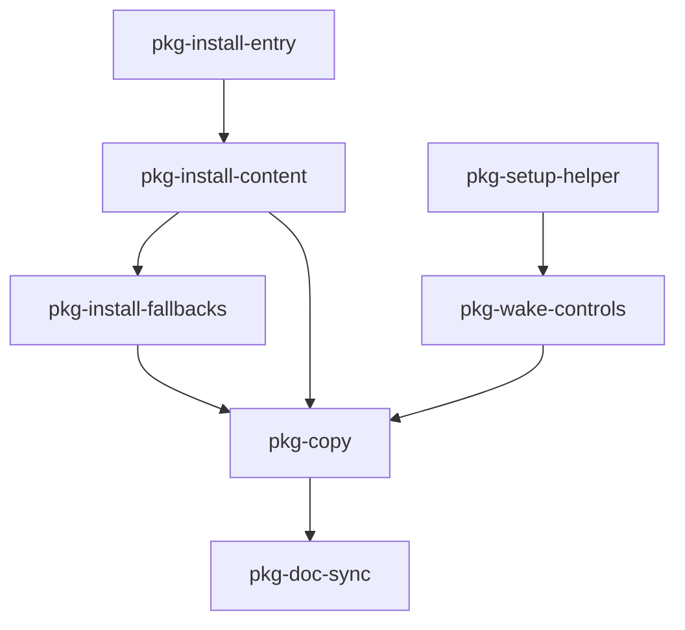

# PWA implementation plan (for coding)

This file is the execution checklist for the current PWA UX direction. It encodes resolved product decisions as source-of-truth implementation work packages.

## Preconditions (already shipped)

- **Screen Wake Lock runtime behaviour** exists on home route (`homeRouteScreenWakeLock.ts`) with tests (`homeRouteScreenWakeLock.test.ts`).
- **Orientation nudge behaviour** already exists and is considered sufficient for this pass.
- Core installability assets already exist in repo (`index.html`, manifest artifact, hosting config), and should be adjusted only as needed by the packages below.

## Non-goals (do not implement in this pass)

- **Service worker** of any kind.
- **New orientation feature work** beyond maintaining existing behaviour.
- **Timed/threshold reminder resurfacing** for install prompts.
- **Telemetry/event instrumentation** until a general-purpose backend/event pipeline exists.

## Multi-session strategy

Splitting work across sessions is recommended. Each package is intentionally reviewable on its own.

**Session handoff:** after each session, update [`implementation-progress.md`](./implementation-progress.md) with package status, decisions made, and any manual verification notes.

Suggested grouping:

| Session focus | Packages | Why separate |
| ------------- | -------- | ------------ |
| A — Install surface | `pkg-install-entry`, `pkg-install-content` | Core UX shift: first-class menu entry + integrated explanation content. |
| B — Keep-awake UX | `pkg-setup-helper`, `pkg-wake-controls` | Shared UX language and state handling around wake lock preferences. |
| C — Platform hardening | `pkg-install-fallbacks`, `pkg-copy` | Platform-specific install instructions and final wording polish. |
| D — Docs alignment | `pkg-doc-sync` | Keep planning/progress docs aligned with shipped behaviour. |

---

## Package `pkg-install-entry` — First-class menu install action

**Goal:** A persistent, first-class `Install app` action in the primary menu (not buried in settings), always available as a recovery path.

**Concrete steps:**

1. Add/update a top-level menu entry labeled `Install app`.
2. Route action through a single install handler for consistent behavior and copy.
3. Keep the entry visible regardless of prior dismissals of browser-originated prompts.

**Acceptance:**

- User can always find `Install app` in the primary menu.
- Entry remains available after closing or dismissing install UI.

**Tests:**

- Add or update unit/component tests to verify menu entry rendering and click wiring.

---

## Package `pkg-install-content` — Install benefits in install flow

**Goal:** Explain install value inside the install flow itself (not via separate banner/tooltip surfaces).

**Concrete steps:**

1. Add concise benefit copy to the install action path:
   - Better fit with less browser chrome.
   - Better immersive usage.
   - Better context for keep-awake behaviour.
2. Ensure content is visible when:
   - `beforeinstallprompt` is available.
   - Manual install instructions are shown as fallback.
3. Remove or avoid introducing separate install explainer surfaces that fragment guidance.

**Acceptance:**

- Install explanation appears in the same user journey as `Install app`.
- No standalone install banner/tooltip is required to understand the benefit.

**Tests:**

- Verify expected copy/fallback branch rendering in existing UI tests where practical.

---

## Package `pkg-setup-helper` — Installed-mode first-run helper (keep-awake only)

**Goal:** Optional, skippable first-run helper in standalone mode focused on keep-awake preference only.

**Concrete steps:**

1. Gate helper to installed/standalone context.
2. Include keep-awake explanation + preference action.
3. Provide:
   - `Skip` behavior.
   - `Don't show again` persistence.
   - Reopen path from menu/help.
4. Do not add orientation onboarding steps.

**Acceptance:**

- Helper can be skipped and permanently dismissed.
- Helper can be reopened from a stable UI surface.
- Orientation messaging is not added to helper flow.

**Tests:**

- Unit tests for persisted dismissal and standalone gating.

---

## Package `pkg-wake-controls` — Explicit keep-awake controls + state

**Goal:** Surface keep-awake as explicit, user-controlled UX with honest state and platform limitations.

**Concrete steps:**

1. Provide a `Keep screen awake` toggle in the agreed UI surface (home and/or menu/settings).
2. Show status feedback as one of:
   - `active`
   - `inactive`
   - `not supported`
3. Include concise tradeoff copy (battery/heat when not charging).
4. Keep runtime behavior best-effort; UI must never imply guaranteed always-on operation.

**Acceptance:**

- User can explicitly enable/disable keep-awake.
- State feedback remains correct through visibility/state transitions.
- Unsupported platforms render honest fallback state.

**Tests:**

- Extend wake-lock tests for state projection into UI controls if needed.

---

## Package `pkg-install-fallbacks` — Manual install instructions by platform

**Goal:** Reliable manual install guidance when browser install prompt APIs are unavailable.

**Concrete steps:**

1. Detect absence/unavailability of `beforeinstallprompt`.
2. Show concise, platform-appropriate instruction copy from the same install flow.
3. Keep fallback guidance compact and rediscoverable from `Install app`.

**Acceptance:**

- Install flow remains useful on platforms without prompt API support.
- User can reopen instructions at any time from menu entry.

**Tests:**

- Unit test fallback branch by stubbing install prompt availability.

---

## Package `pkg-copy` — Final UX copy pass

**Goal:** Ensure all new PWA UX copy is concise, honest, and internally consistent.

**Concrete steps:**

1. Normalize wording across:
   - `Install app` entry/action text.
   - Install benefits/fallback instructions.
   - Keep-awake helper and controls.
2. Confirm copy does not promise behaviour the platform cannot guarantee.
3. Remove stale wording that references deferred features (timed reminders, telemetry).

**Acceptance:**

- Copy is consistent across all relevant surfaces.
- No overpromising language remains.

---

## Package `pkg-doc-sync` — Planning docs alignment

**Goal:** Keep planning docs aligned with resolved scope and shipped behavior.

**Concrete steps:**

1. Update `implementation-progress.md` after each completed package.
2. Keep this file and `ux-improvements-plan.md` aligned on:
   - first-class install menu entry
   - install-flow-integrated explanation
   - orientation no-change scope
   - telemetry deferred status
3. Update `implementation.md` only when architectural judgments change.

**Acceptance:**

- Docs no longer contain unresolved TODO framing for decisions already made.
- Next coding session can start from package checklist without reinterpreting intent.

---

## Dependency graph (Mermaid)

`pkg-install-entry` and `pkg-setup-helper` can begin in parallel. `pkg-doc-sync` runs after each merged package and closes the loop at the end of the pass.

---

## Definition of done (current PWA UX pass)

- [ ] `pkg-install-entry` shipped with persistent top-level menu access.
- [ ] `pkg-install-content` shipped with benefit copy embedded in install flow.
- [ ] `pkg-install-fallbacks` shipped for non-`beforeinstallprompt` platforms.
- [ ] `pkg-setup-helper` shipped as optional/skip/don't-show-again flow (keep-awake only).
- [ ] `pkg-wake-controls` shipped with explicit toggle and accurate state (`active`/`inactive`/`not supported`).
- [ ] `pkg-copy` completed with honest, consistent messaging.
- [ ] `pkg-doc-sync` completed (`implementation-progress.md` updated, plans aligned).
- [ ] No service worker added; no new orientation feature work added; telemetry remains deferred.

When all required boxes are checked, record completion in `implementation-progress.md` and update `implementation.md` only if architectural decisions changed.
