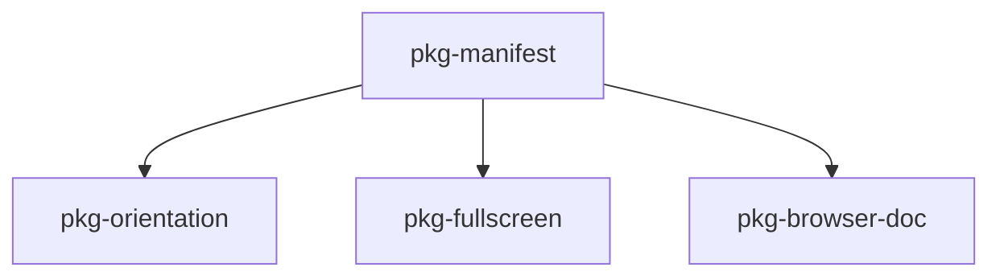

# PWA implementation plan (for coding)

This file turns [`implementation.md`](./implementation.md) into ordered, agent-sized work packages. It is the **execution checklist**; keep judgments and rationale in `implementation.md`.

## Preconditions (already shipped)

- **Screen Wake Lock** on the home / instrument route: `src/ui/routes/home/homeRouteScreenWakeLock.ts`, mounted from `HomeRoute.svelte`, with tests in `homeRouteScreenWakeLock.test.ts`. Behaviour matches the doc: acquire while visible, release on hide, re-acquire after visibility return and on sentinel `release`. **No further wake-lock logic is required for the initial PWA milestone** unless you add product UI (see optional package below).

## Non-goals (do not implement)

- **Service worker** of any kind (including Vite PWA plugin precache). Decision is recorded at the top of `implementation.md`.
- **Kiosk / OS-level appliance** positioning; fullscreen and orientation are **best-effort progressive enhancement** only.

## Multi-session strategy

Splitting work across sessions **is recommended**: each package below touches different surfaces (build/static assets vs runtime APIs vs hosting config vs copy), and manual checks on real phones benefit from pausing between merges.

**Session handoff:** after each session, update [`implementation-progress.md`](./implementation-progress.md) so the next run starts with a clear “next package” and does not re-read the whole rationale.

Suggested grouping:

| Session focus | Packages | Why separate |
| ------------- | -------- | ------------ |
| A — Installability shell | `pkg-manifest` | Icons + manifest + `index.html` wiring; easy to review in one PR. |
| B — Deploy caching | `pkg-host-cache` | Vercel/headers only; verify with curl or deploy preview, not unit tests. |
| C — Landscape lock | `pkg-orientation` | Small TS module + home route hook; needs device smoke tests. |
| D — Fullscreen | `pkg-fullscreen` | UX placement and gesture rules; can ship after manifest. |
| E — Polish + docs | `pkg-wake-ui`, `pkg-copy`, `pkg-browser-doc` | Small, optional, or documentation-only. |

Packages C and D can swap order if you prefer “chrome removal” before orientation lock, but orientation lock should still not depend on fullscreen.

---

## Package `pkg-manifest` — Web app manifest + icons

**Goal:** Installable PWA shell: correct name, `display`, start URL, theme/background colours, landscape **hint** via manifest `orientation`, and icons that meet common platform minimums.

**Concrete steps:**

1. Add a **Web App Manifest** (e.g. `public/site.webmanifest` or `public/manifest.webmanifest` — pick one name and keep it stable). Fields to include at minimum:
   - `name` / `short_name` (align with product strings used in `index.html` title or marketing copy).
   - `start_url` and `scope` (typically `/` for this SPA; confirm router base).
   - `display`: `standalone` (per rationale: instrument-like chrome).
   - `orientation`: prefer **`landscape`** or **`landscape-primary`** as a hint; document in a one-line comment in manifest or adjacent README note that **tab behaviour is unchanged** and letterbox UX remains authoritative.
   - `theme_color` / `background_color` (match existing UI chrome if any; otherwise neutral values consistent with home screen).
   - `icons`: provide **192** and **512** PNG (or maskable variants if you generate them); reuse or derive from `public/favicon.svg` if practical.

2. Wire in **`index.html`**:
   - `<link rel="manifest" href="…">`
   - Optional: `meta name="theme-color"` for tab UI consistency.

3. **Vite:** ensure manifest and icons live under `public/` so they are emitted at stable URLs without hashing (correct for manifest icon references).

**Acceptance:**

- Lighthouse PWA (or manual “Install app”) sees a manifest with icons and `standalone`.
- Opening installed app loads the same entry as the site; no broken icon URLs.

**Tests:** Automated tests optional; manifest is static. If you add a small build check (JSON parse), keep it minimal.

---

## Package `pkg-host-cache` — HTTP caching for shell vs hashed assets

**Goal:** Align deployed responses with `implementation.md`: long cache for **immutable hashed** JS/CSS; **short or revalidate** policy for `index.html` so deploys propagate quickly. **No service worker.**

**Concrete steps:**

1. Inspect current deployment path (e.g. Vercel project defaults). If `index.html` is already non-aggressive, document the observed headers in `implementation-progress.md` or a single comment in config and **close the package**.

2. If not, add configuration (e.g. `vercel.json` `headers`) so that:
   - `index.html` (or `/`) is not `immutable` long-cache.
   - Static build output matching hashed asset patterns can use `Cache-Control` with long `max-age` and `immutable` where the host supports it.

**Acceptance:**

- Deploy preview: response headers for `/` vs a hashed asset file match the intent above (record example values in progress file once verified).

**Tests:** None in repo unless you add a trivial script; this is infra verification.

---

## Package `pkg-orientation` — Screen Orientation API (best-effort)

**Goal:** In **display-mode standalone** (or equivalent installed context), optionally call `screen.orientation.lock('landscape')` **after a user gesture** when the platform requires it, with **silent catch** on failure. Never replace `displayOptimisation` / portrait hint; those remain the safety net.

**Concrete steps:**

1. Add a small module (e.g. `src/ui/routes/home/homeRouteOrientationLock.ts` or under `src/ui/pwa/`) that:
   - Detects support: `screen.orientation?.lock`.
   - Detects installed context: `matchMedia('(display-mode: standalone)')` or `window.matchMedia('(display-mode: standalone)').matches` — also consider `fullscreen` if you want parity with some Android behaviours (optional, document choice).
   - Exposes a function like `requestHomeLandscapeOrientationLock(): void` that no-ops if unsupported or not standalone, otherwise calls `lock('landscape')` in a try/catch (or promise catch).

2. **Invocation:** tie to an explicit user action rather than `onMount` alone — e.g. first tap on the diagram/instrument area, or a dedicated “Lock landscape” control in an overflow menu, depending on product preference. **Default:** one-shot attempt on first user interaction inside home route while standalone, to avoid spamming `lock()` on every mount.

3. Wire from `HomeRoute.svelte` with minimal surface (import + handler or `onMount` subscription that registers a once listener).

**Acceptance:**

- In desktop browser tab: no lock attempted (or attempt only in standalone — must not break).
- In installed PWA on a device that allows lock: landscape lock succeeds or fails silently; portrait hint path still works when lock fails.

**Tests:** Unit-test the gating logic with stubbed `matchMedia` and fake `screen.orientation`; do not depend on real orientation in CI.

---

## Package `pkg-fullscreen` — Optional Fullscreen API

**Goal:** User-triggered **element or document fullscreen** on handheld/tablet emphasis; **available but not default** on desktop for “wall PC” use. No auto-fullscreen on load.

**Concrete steps:**

1. Decide **UX surface**: e.g. item in existing home menu, or subtle control near the landscape hint. Must be **activated by user gesture** (`requestFullscreen` requirement).

2. Implement a helper (e.g. `requestInstrumentFullscreen(el: HTMLElement): Promise<void>`) with feature detection, try/catch, and **exit** path if you need toggle behaviour.

3. Gate prominence by `displayOptimisation` / device class if you want stronger nudge on phone/tablet and quieter on desktop — match existing patterns in `HomeRoute.svelte` / `displayOptimisation.ts`.

**Acceptance:**

- Fullscreen never enters without user action.
- Failure leaves current letterboxed layout unchanged.

**Tests:** Mock `requestFullscreen` / `fullscreenElement` in unit tests for the helper only.

---

## Package `pkg-wake-ui` — Optional “wake active” indicator (optional)

**Goal:** Satisfy `implementation.md` § “Optional subtle UI”: small indicator when wake lock is held, without implying a guarantee.

**Concrete steps:**

1. Extend `mountHomeRouteScreenWakeLock` to accept an optional callback, or expose a tiny store updated on acquire/release — **prefer minimal coupling** so tests stay simple.

2. Add unobtrusive UI in `HomeRoute.svelte` (or a child component) visible only when lock is active.

**Acceptance:** Indicator appears/disappears with lock state in a dev build with fake wake lock; no layout shift on the main diagram.

**Tests:** Extend existing wake lock tests if callback/store is added.

---

## Package `pkg-copy` — Expectations copy for wall / tablet

**Goal:** Light-touch honest copy (settings menu, footer, or existing landscape hint area) that mentions OS sleep / brightness where the web cannot promise behaviour.

**Concrete steps:** Single copy pass; link to or echo tone from `pwa-rationale.md`. Avoid duplicating long policy in multiple places.

**Acceptance:** Copy is short and accurate; no claim that PWA replaces OS display sleep.

---

## Package `pkg-browser-doc` — Target browsers / limitations

**Goal:** Close the “open follow-ups” loop in `implementation.md`: short **baselines + known limitations** (wake lock on iOS Safari, orientation lock quirks, install UI differences).

**Concrete steps:** Add a subsection to `key-questions.md` or a new `browser-notes.md` in this folder — **keep it one page**.

**Acceptance:** Future sessions can point QA at that list.

---

## Dependency graph (Mermaid)

`pkg-orientation` and `pkg-fullscreen` are **parallel** after the manifest exists. **`pkg-host-cache`** is infra-only (no edge above). **`pkg-wake-ui`** and **`pkg-copy`** are optional polish with no hard deps.

---

## Definition of done (initial PWA milestone)

- [ ] `pkg-manifest` shipped and installable on at least one target (e.g. Android Chrome + desktop Chrome).
- [ ] `pkg-host-cache` verified or explicitly documented as already correct.
- [ ] `pkg-orientation` shipped with silent failure and no regression to portrait hint.
- [ ] `pkg-fullscreen` shipped as opt-in gesture-driven enhancement.
- [ ] Optional: `pkg-wake-ui`, `pkg-copy`, `pkg-browser-doc`.
- [ ] Wake lock remains as today; no service worker added.

When all required boxes are checked, update `implementation.md` only if judgments changed (per user workflow); otherwise `implementation-progress.md` can record completion date.
