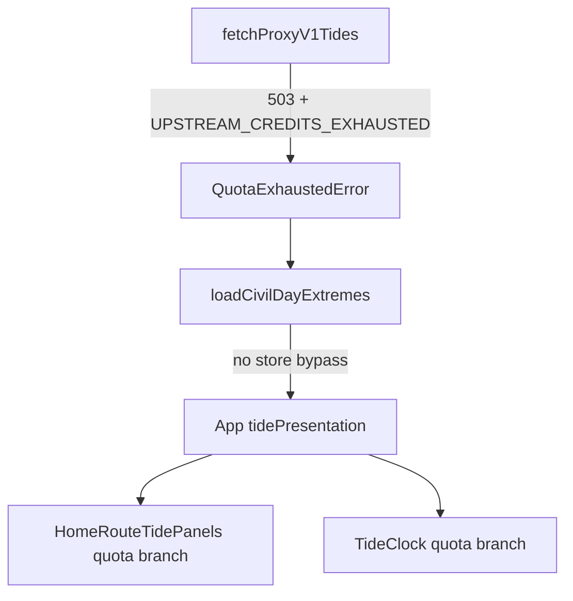

# Tide proxy quota exhaustion — rationale and implementation plan

## Purpose

This document captures agreed product and engineering intent for handling `UPSTREAM_CREDITS_EXHAUSTED` from the Tide Proxy API ([OpenAPI spec](https://github.com/peterhoward42/tideproxy/blob/main/openapi.yaml): HTTP `503`, error code `UPSTREAM_CREDITS_EXHAUSTED`, fixed message `"Monthly API credits exhausted"`).

It is a planning artefact only. Final UX copy and visual design are TBD; interim placeholder UI is specified so implementation can proceed in layers.

---

# Part 1 — Rationale and strategy

## Problem

WorldTides access is mediated by a small proxy the operator pays for. When monthly operator credits are exhausted, the proxy returns a definitive, non–caller-fault signal. The app must:

1. **Never present tide times it knows it cannot vouch for** — including cached `localStorage` slices that would bypass a failed fetch.
2. **Treat quota exhaustion as a first-class presentation mode**, not a generic “check your connection” error.
3. **Explain honestly** that a shared upstream quota exists and is funded by the operator, speaking to users as friends rather than as support tickets.
4. **Remain self-healing** without aggressive polling: heartbeat and scheduled retries stay cheap; recovery is acceptable on a civil-day or human-action timescale.

## What this is not

| Misconception | Actual stance |
|---------------|---------------|
| Degraded mode (stale chart + banner) | **Rejected.** Stale or cached tides when quota is known exhausted are worse than an empty instrument. |
| Generic environmental error | **Rejected** for quota. Copy must not imply Wi‑Fi or user misconfiguration. |
| Same UX as `502` / network blips | **Rejected.** Upstream outage may warrant neutral retry messaging; quota is operator-funded capacity. |

## Product principles

1. **Fail-closed on display** — Once quota exhaustion is detected for the session, do not enter `ready` with tide extremes for the instrument until a fetch succeeds again.
2. **Fail-open on heartbeat** — Minute cadence, civil-day rollover checks, wake lock, and routing continue. Only tide *presentation* is blocked.
3. **Classify at the HTTP boundary** — Trigger only on `503` + `UPSTREAM_CREDITS_EXHAUSTED`, not message-string heuristics.
4. **Separate plumbing from copy** — Shell exposes a stable `tidePresentation` (or equivalent) state; UI branches on it. Wording can ship later.
5. **Implicit recovery is enough** — No same-day polling. Existing triggers (mount, location change, civil-day rollover) plus full page reload are sufficient given rare occurrence and expected operator fix within ~24 hours.

## Self-healing (existing behaviour to preserve)

Production fetch triggers today:

| Trigger | Retry character |
|---------|-----------------|
| App mount | Immediate (each full load) |
| User changes location (`setCurrentLocation`) | Immediate |
| Local civil-day rollover | At most **once per civil day**, only if `lastSuccessfulLoadCivilDayStartMs` is defined |
| Minute cadence | Does **not** refetch; only evaluates rollover |

Implications:

- **~24h automatic retry** — For users who have previously loaded successfully, rollover attempts one fetch on the next local civil day (suppressed for the rest of that day if it fails).
- **Same-day recovery** — Credits restored the same day require **page reload** or **location change**; rollover will not fire again the same civil day.
- **First visit, never succeeded** — Rollover does not run until a first success exists; reload or location pick remains the path.

Quota mode must **not** clear `civilDayWindowStartMsAtLastSuccessfulLoad` in a way that disables rollover unless that is an explicit future decision.

## Operator notes

For whoever operates the WorldTides / proxy billing:

1. **Monitor** the [WorldTides](https://www.worldtides.info/) dashboard (and proxy-side credit usage) so monthly exhaustion is visible before users report it.
2. **While exhausted** the app enters `quotaExhausted` presentation: honest “paused” copy, empty dial, no tide times from cache or network.
3. **Credits restored the same civil day** — users need a **full page reload** or **location change**; rollover will not attempt another fetch until the next local civil day (and only once per day after a prior successful load).
4. **Credits restored overnight** — returning users who had loaded successfully before quota usually recover via **local civil-day rollover** (one fetch); first-time visitors still need reload or a location pick.

Dev check without burning credits: `?tideUxPreview=quota-exhausted` (DEV builds only; see README).

## Placeholder UX (interim)

Until final design, use a dedicated home panel (and matching `TideClock` line) distinct from generic error:

**Headline (placeholder):**  
`Tide data is paused`

**Body (placeholder):**  
`The shared tide API I pay for has hit its monthly limit. I’m not showing tide times until that’s fixed — I’d rather leave the dial empty than show something wrong. It usually comes back within a day; changing location or reloading tomorrow will try again.`

**Tone:** First person, operator-as-host, no “check your connection.”

**Chrome:** Empty diagram host (same gates as today’s error path). Wall clock / non-tide chrome may remain if already shown elsewhere.

Generic error copy stays for all other failures (`502`, `500`, network, etc.).

---

# Part 2 — Implementation plan

## Overview

Work in layers: classify at the proxy adapter → propagate through load orchestration → shell presentation state → UI branch → dev preview → tests.



## Stage 1 — Typed proxy failure

**Files:** `src/data-pipelines/proxyV1Types.ts`, `src/data-pipelines/fetchProxyV1Tides.ts`

1. Extend types with a closed set of proxy error codes (at minimum `UPSTREAM_CREDITS_EXHAUSTED`; optionally align full enum from OpenAPI).
2. Introduce a dedicated error class, e.g. `ProxyQuotaExhaustedError`, carrying `code` and `status` (503).
3. In `fetchProxyV1Tides`, on non-OK JSON with `error.code === 'UPSTREAM_CREDITS_EXHAUSTED'`, throw that class instead of a generic `Error`.
4. Keep generic `Error` (or a sibling `ProxyRequestError`) for other codes.

**Tests:** Unit tests in `fetchProxyV1Tides.test.ts` (new or extended) for 503 body, wrong code, malformed body.

## Stage 2 — Load path respects quota (fail-closed)

**Files:** `src/data-pipelines/fetchPersistExtremes.ts`, `src/application/civilDayExtremesQuery.ts`

1. Let `fetchPersistExtremes` propagate `ProxyQuotaExhaustedError` unchanged.
2. In `loadCivilDayExtremes`:
   - On store hit: **if** shell has signalled quota-active for this session (see Stage 3), skip returning cached slice and proceed to fetch (or short-circuit to quota outcome without network — policy: prefer one code path via fetch so recovery is a real 200).
   - Simpler initial policy: **always attempt fetch when quota flag is set**; on first quota detection without flag, set flag and do not return store.
   - On store miss: fetch as today; quota throw propagates.
3. Do **not** call `storer.setItem` when fetch fails with quota.

**Alternative (smaller first slice):** Always fetch when `sessionQuotaExhausted` is true; on first 503 set flag and never read store until success. Document in code comment.

**Tests:** `civilDayExtremesQuery.test.ts` — store hit + quota flag → does not return cached without successful fetch; quota throw surfaces.

## Stage 3 — Shell presentation state

**Files:** `src/application/tideRefreshController.ts`, `src/ui/App.svelte`, `src/ui/routes/home/routeProps.ts`

1. Add a first-class tide presentation discriminant, e.g.:

   ```ts
   type TidePresentation =
     | { kind: 'loading' }
     | { kind: 'ready' }
     | { kind: 'loadFailed' }      // generic
     | { kind: 'quotaExhausted' };
   ```

   Replace or subsume `{ status: 'loading' | 'ready' | 'error' }` so quota is not `error`.

2. In `createTideRefreshController` callbacks:
   - `onQuotaExhausted` (or inspect error type in `onLoadRejected`) → set `quotaExhausted`, do not call generic `onError` if semantics differ only in UI.
   - `onSuccess` → clear quota flag, set `ready`.
   - Generic catch → `loadFailed`.

3. `App.svelte`:
   - `sessionQuotaExhausted` boolean (or derive from presentation kind).
   - Pass `tidePresentation` (and still pass `tideExtremes` only when `ready`).
   - On quota: do not pass extremes to Home; keep `lastSuccessfulTideExtremes` out of diagram path (already gated by `ready` in `HomeRoute`).

4. Thread props: `Home.svelte` → `HomeRoute` → `HomeRouteTidePanels`; `TideClock` if used on home.

**Tests:** `tideRefreshController.test.ts` — quota error invokes quota callback, not generic error.

## Stage 4 — UI placeholder branch

**Files:** `src/ui/routes/home/HomeRouteTidePanels.svelte`, `src/ui/components/TideClock.svelte`

1. Add branch before generic `error`:

   ```svelte
   {:else if tidePresentation.kind === 'quotaExhausted'}
     <!-- placeholder copy from Part 1 -->
   ```

2. Ensure `HomeRoute` diagram `$effect` treats `quotaExhausted` like non-ready (clear `diagramSvg`).

3. Mirror short status in `TideClock` if it receives load/presentation state on home.

4. Optional: `role="status"` (not `alert`) — informational, not user fault.

**No final design required** for this stage; placeholder strings only.

## Stage 5 — Dev preview

**Files:** `src/application/tide-dev-preview/previewCatalog.ts`, `App.svelte` load override

1. Add `tideUxPreview=quota-exhausted` that throws or returns a path into `quotaExhausted` presentation without hitting the network.
2. Headline in dev banner: `quota exhausted (simulated)`.

## Stage 6 — Documentation and operator notes

1. Link this doc from `SoftwareNerdRoute` or internal comments if appropriate (optional).
2. Note for operator: monitor WorldTides dashboard; same-day fix = user reload; next-day fix = rollover for returning users.

## Out of scope (for this plan)

- Changing proxy or credit limits.
- User-facing credit counters or billing.
- Retrying quota on a timer within the same civil day.
- Persisting quota state across browser sessions (session-only flag is enough for v1; cross-session store bypass is the main leak to close via fetch-on-quota or invalidating trust in cache).

## Acceptance criteria

1. Simulated or real `503` + `UPSTREAM_CREDITS_EXHAUSTED` shows placeholder quota panel, not generic error.
2. No tide diagram or tide time labels while in quota mode.
3. Cached `localStorage` slice is **not** shown after quota detected in session.
4. Successful fetch after recovery returns to `ready` and diagram.
5. Minute cadence and civil-day rollover still run; at most one rollover fetch per civil day on failure.
6. Generic failures unchanged.
7. Dev preview `quota-exhausted` available in DEV builds.

## Suggested implementation order

| Order | Stage | Rationale |
|-------|-------|-----------|
| 1 | Typed proxy error | Single source of truth for detection |
| 2 | Shell presentation state | Unblocks UI and tests without final copy |
| 3 | Fail-closed load path | Correctness before polish |
| 4 | Placeholder UI | Visible end-to-end |
| 5 | Dev preview | Manual QA |
| 6 | Tests throughout | Per stage |

## File touch list (expected)

- `src/data-pipelines/proxyV1Types.ts`
- `src/data-pipelines/fetchProxyV1Tides.ts` (+ test)
- `src/application/civilDayExtremesQuery.ts` (+ test)
- `src/application/tideRefreshController.ts` (+ test)
- `src/ui/App.svelte`
- `src/ui/routes/home/routeProps.ts`
- `src/ui/routes/Home.svelte`
- `src/ui/routes/home/HomeRoute.svelte`
- `src/ui/routes/home/HomeRouteTidePanels.svelte`
- `src/ui/components/TideClock.svelte`
- `src/application/tide-dev-preview/previewCatalog.ts`

---

## Implementation status

Stages 1–5 are implemented in the tideclock repo (typed proxy error → fail-closed load path → `TidePresentation` shell state → placeholder UI → dev preview).

*Aligned in discussion: quota is a useless-for-tides mode with honest operator messaging, not degraded cache display; plumbing is a presentation trigger, not error-handling taxonomy.*
