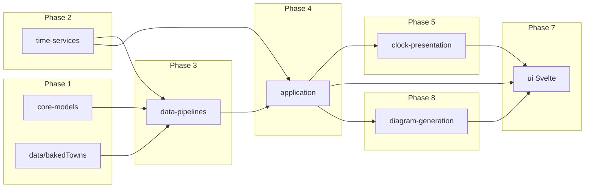

# TypeScript skill rollout (session-sized chunks)

This plan applies the guidance in **`~/.cursor/skills/typescript-coding/SKILL.md`** across the repo in an order that respects dependencies and keeps each step small enough for one focused working session. It is a **quality pass**, not a feature roadmap: behaviour and public APIs should stay the same unless a change is clearly required to make inputs or effects honest.

## What “apply the skill” means here

Use the skill as a **checklist** per step, not a rewrite mandate:

- **Honest signatures** — functions take what they conceptually need; avoid optional parameters or internal fallbacks that hide missing data.
- **Clarity over flexibility** — match the system that exists; no new abstraction without a concrete caller need.
- **Useful types** — named input/output types at boundaries, `readonly` where values are only read, types that answer “what varies?” and “who owns state?”
- **Scope discipline** — touch only the files listed for that step (and their tests); run the relevant tests before moving on.

If a step finishes with “nothing needed,” that is a valid outcome; note it in `log.txt` or a short PR description so progress is visible.

## Conventions for each session

1. Complete **one numbered step** (or a explicitly allowed subset noted in that step).
2. Run **`npx vitest run`** on the tests that cover the touched paths (or full suite if the change is cross-cutting).
3. Prefer **one PR or one logical commit** per step so review and bisect stay easy.
4. **Diagram-generation `.mjs`** is JavaScript application code: same doctrines apply (clear parameters, no silent defaults for required data). Converting to TypeScript is **out of scope** for this rollout unless a future step explicitly adds it.

---

## Phase 1 — Core models and static data (low coupling)

**Step 1 — Core tide models**  
Files: `src/core-models/TideExtreme.ts`, `src/core-models/TideExtremesAtLocation.ts`.  
Goal: ensure exported shapes and any constructors/factories reflect required vs optional fields honestly.

**Step 2 — Baked town list**  
Files: `src/data/bakedTowns.ts`, `src/data/bakedTowns.test.ts`.  
Goal: tighten types for town records and any helpers; keep data file readable.

---

## Phase 2 — Time and civil-day window

**Step 3 — Civil-day display window model**  
Files: `src/time-services/TideClockCivilDayDisplayWindow.ts`.  
Goal: clear ownership of “window” semantics; honest factory/provider inputs if any.

**Step 4 — Current display window accessor**  
Files: `src/time-services/getCurrentTideClockCivilDayDisplayWindow.ts`, `src/time-services/getCurrentTideClockCivilDayDisplayWindow.test.ts`.  
Goal: explicit dependencies (e.g. clock vs real time); avoid hidden globals where the skill prefers injection.

---

## Phase 3 — Data pipelines (TypeScript)

**Step 5 — Proxy response typing and fetch**  
Files: `src/data-pipelines/proxyV1Types.ts`, `src/data-pipelines/fetchProxyV1Tides.ts`.  
Goal: types match the real proxy; fetch API surface is honest about required URL/options.

**Step 6 — Build domain snapshot from proxy**  
Files: `src/data-pipelines/buildFromProxy.ts`, `src/data-pipelines/buildFromProxy.test.ts`.  
Goal: parsing/mapping functions with explicit inputs; no papering over malformed API data inside generic helpers.

**Step 7 — Fetch and store extremes**  
Files: `src/data-pipelines/fetchStoreExtremes.ts`, `src/data-pipelines/fetchStoreExtremes.test.ts`.  
Goal: dependency object (`fetch`, storage) clarity; same as skill’s “interface seams for tests.”

**Step 8 — Snapshot and location persistence**  
Files: `src/data-pipelines/extremesSnapshot.ts`, `src/data-pipelines/currentLocation.ts`, `src/data-pipelines/currentLocationSnapshot.ts`, `src/data-pipelines/currentLocation.test.ts`.  
Note: there is no dedicated `extremesSnapshot` test file; behaviour is covered indirectly via other pipeline tests—avoid broad refactors without adding targeted tests in the same step if you change snapshot semantics.  
Goal: small modules; explicit storage keys and loader/storer roles.

**Step 9 — Civil-day extremes query**  
Files: `src/data-pipelines/civilDayExtremes.ts`, `src/data-pipelines/civilDayExtremes.test.ts`.  
Note: test file is relatively large; stay within these two files unless a bug forces a neighbour change.  
Goal: query helpers require explicit coordinates and time/window inputs.

---

## Phase 4 — Application layer (TypeScript)

**Step 10 — Minute cadence subscription**  
Files: `src/application/semanticMinuteCadence.ts`, `src/application/semanticMinuteCadence.test.ts`.  
Goal: defaults (`fireImmediately`, `now`) only where they are part of the real contract.

**Step 11 — Next-tide semantics**  
Files: `src/application/nextTideSemantics.ts`, `src/application/nextTideSemantics.test.ts`.  
Goal: reduce `unknown`/`Record<string, unknown>` at the boundary if a real spec type exists or can be introduced without rippling diagram-generation in the same session.

**Step 12 — Diagram generation collaborator**  
Files: `src/application/diagramGenerationCollaborator.ts`, `src/application/diagramGenerationCollaborator.test.ts`.  
Goal: honest typing for `spec` / outputs where safe; avoid pretending more precision than `buildDiagram` actually provides.

**Step 13 — Diagram spec builder**  
Files: `src/application/buildDiagramGenerationSpec.ts`, `src/application/buildDiagramGenerationSpec.test.ts`.  
Goal: explicit inputs for whatever varies (town, window, extremes); named types for intermediate bundles if it helps readers.

**Step 14 — Semantic injection tests / wiring**  
Files: `src/application/diagramSemanticInjection.test.ts` (and only minimal changes in production files if tests reveal a dishonest API).  
Goal: tests document intended seams; production signatures align.

**Step 15 — Tide extremes load query (UI-facing)**  
Files: `src/application/tideExtremesForCivilDayQuery.ts`, `src/application/tideExtremesForCivilDayQuery.test.ts`.  
Goal: `TideExtremesForCivilDayQueryDeps` and optional overrides (`fetchImpl`, `timeNowProvider`) match the skill’s rules on defaults and optionals.

**Step 16 — Civil-day rollover refresh**  
Files: `src/application/civilDayRolloverRefresh.ts`, `src/application/civilDayRolloverRefresh.test.ts`.  
Status: **already piloted** (`CivilDayRolloverRefreshInput`). Revisit only if neighbouring steps change call patterns.

---

## Phase 5 — Clock presentation

**Step 17 — Normalized dial space**  
Files: `src/clock-presentation/normalizedDialSpace.ts`.  
Goal: pure geometry helpers with explicit parameters.

**Step 18 — Clock division geometry**  
Files: `src/clock-presentation/clockDivisionGeometry.ts`, `src/clock-presentation/clockDivisionGeometry.test.ts`.

**Step 19 — Clock scene model**  
Files: `src/clock-presentation/clockSceneModel.ts`.

**Step 20 — Home screen model**  
Files: `src/clock-presentation/homeScreenModel.ts`.  
Goal: boundary between presentation structs and diagram/UI callers stays explicit.

---

## Phase 6 — Shell, router, and SVG mapping

**Step 21 — Entry and clock utilities (JS)**  
Files: `src/main.js`, `src/application/appClock.js`, `src/infrastructure/router.js`, `src/ui/dialFrame.js`.  
Goal: same honesty principles without TS; document tricky side effects in a line or two only where behaviour is non-obvious.

**Step 22 — SVG path mapping**  
Files: `src/ui/svg/clockPathMapping.ts`, `src/ui/svg/clockPathMapping.test.ts`.

---

## Phase 7 — Svelte UI (script blocks and boundaries)

Treat each step as **`<script lang="ts">` and clearly related imports**, not visual markup refactors.

**Step 23 — Small routes**  
Files: `src/ui/routes/About.svelte`, `Acknowledgements.svelte`, `Cookies.svelte`, `Support.svelte`, `Settings.svelte` (adjust list if files are added/removed).  
Goal: typed props/state; orchestration stays thin.

**Step 24 — Location route**  
Files: `src/ui/routes/Location.svelte`.

**Step 25 — Home route**  
Files: `src/ui/routes/Home.svelte`.  
Note: larger file; do not also refactor diagram-generation in the same session.

**Step 26 — Clock components**  
Files: `src/ui/components/TideClock.svelte`, `src/ui/components/ClockDivisionDial.svelte`.

**Step 27 — App shell**  
Files: `src/ui/App.svelte`.  
Note: central orchestration; one session on its own. Optionally align the `shouldTriggerCivilDayRolloverRefresh` argument with `CivilDayRolloverRefreshInput` if that stays a one-line type import.

---

## Phase 8 — Diagram generation (JavaScript modules)

**Step 28 — Time canonical and tide events**  
Files: `src/diagram-generation/model/timeCanonical.mjs`, `src/diagram-generation/model/tideEvents.mjs`.  
Goal: parser helpers with explicit inputs; throw vs null policies consistent and documented at function level.

**Step 29 — Diagram and scene models**  
Files: `src/diagram-generation/model/tideDiagramModel.mjs`, `src/diagram-generation/model/sceneModel.mjs`.

**Step 30 — Tide marks layout**  
Files: `src/diagram-generation/layout/tideMarks.mjs`.

**Step 31 — Next and now pointers**  
Files: `src/diagram-generation/layout/nextPointer.mjs`, `src/diagram-generation/layout/nowPointer.mjs`.

**Step 32 — Centre cluster**  
Files: `src/diagram-generation/layout/centreCluster.mjs`.

**Step 33 — Diagram build orchestration**  
Files: `src/diagram-generation/layout/buildDiagram.mjs`.  
Note: hub module; expect cross-references but keep edits local to layout composition and passed spec shape.

**Step 34 — Scene mapping**  
Files: `src/diagram-generation/mapping/toScene.mjs` only.  
Note: **large** (~480+ lines); entire step is this file to avoid mixing with layout or render.

**Step 35 — SVG render**  
Files: `src/diagram-generation/render/renderSceneSvg.mjs` only.  
Note: **large** (~580+ lines); same rule as Step 34.

**Step 36 — Presets and package entry**  
Files: `src/diagram-generation/presets/staticStyleModel.mjs`, `styleBindings.mjs`, `lineStyleRendering.mjs`, `src/diagram-generation/index.mjs`.  
Goal: exports remain stable; clarify any “options” objects passed into layout/render.

---

## Phase 9 — Closure

**Step 37 — Repo-wide sanity check**  
Run full `npx vitest run` and a quick manual smoke of dev build. Fix only regressions introduced by earlier steps; no new refactors.

**Step 38 — Optional follow-up (separate initiative)**  
TypeScript migration of `src/diagram-generation/**/*.mjs` or stricter shared spec types between application and diagram-generation — **not** part of this skill rollout unless you open a dedicated plan.

---

## Dependency graph (why this order)

Application and diagram-generation both consume lower layers; UI comes after application and presentation types are stable. Diagram-generation is last so spec-type improvements in **Step 11–13** can settle before large `.mjs` passes, and the biggest files (`toScene`, `renderSceneSvg`) are isolated in **Steps 34–35**.

---

## Adjusting chunk size

- If a step feels too big, split it **vertically** (e.g. Step 8: snapshot module one session, current location the next) and keep this document updated with substeps `8a` / `8b`.
- If a step is trivial, combine **only adjacent steps in the same phase** (e.g. Steps 17–18) in one session—do not skip phases or jump into `toScene.mjs` early.
